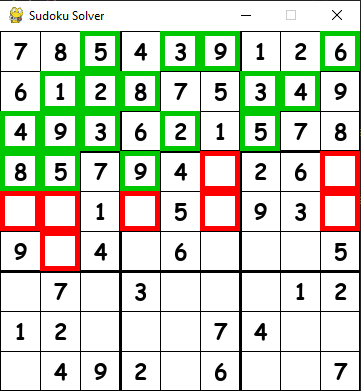

# sudoku_solver

Sudoku solver and visualizer with GUI

@gontluc march 2022

Main file: **sudoku_visualizer.py**

 

 

---

OBJECTIVE: Build a sudoku solver using backtracking algorithm and display steps in a GUI while solving.

---

 

Uses pygame module.

 

---

VISUALIZE: Run and press SPACE to start solving it. Q to quit at anytime.

---

 

Observations:

* Games 2 and 3 take a while to solve with GUI even at 60fps.

* Game 1 best at 10 fps.

* Can change games at the bottom of the code. Three posible games.

* Probably has some code that could be done better and more efficient.

* Good learning experience.
